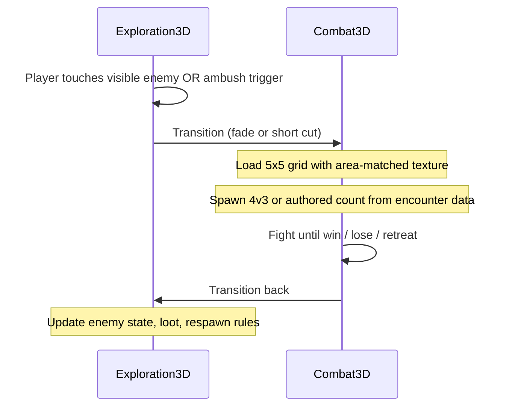

# Prototype Plan

Defines **Phase 1** (combat greybox) and **Phase 2** (exploration + handoff) scope so implementation can start without resolving every full-game TBD. Full-game rules remain in [combat.md](combat.md), [attributes.md](attributes.md), and [exploration.md](exploration.md).

## Phase overview

| Phase | Goal | Dimensionality |
|-------|------|----------------|
| **Phase 1 (v0)** | Prove tactical combat loop | **3D battle view** on a 5×5 grid; no playable exploration module |
| **Phase 2** | Explore → fight → return | **3D exploration** (fixed/tracking cameras) linked to Phase 1 combat |

**Decided:** **Combat-first.** Exploration is documented now but built after the combat greybox is fun.

---

## Phase 1 — Combat greybox (v0)

### Success criteria

- 4 allies vs 3 enemies on shared **5×5** grid
- Turn flow: **Move + Action** (either order), or **Wait** (skips both)
- CTB-style turn order: higher **Agility** acts first; sufficiently higher AGI may gain **extra turns** (exact formula **TBD** — principle only for v0)
- Physical hit/damage and at least **one spell** using documented stat rules (placeholders OK)
- Win, lose, and **Retreat** (from Action submenu) functional on test map

### Test roster

**Decided:** Fixed **4 allies vs 3 enemies** for v0 (stress-tests grid congestion vs final 1–4 / 1–4 range).

**TBD:** Specific test character/enemy names and placeholder stats.

### Battle grid (logic + presentation)

**Decided:**

- **Logic:** 5×5 coordinate grid (e.g. `Vector2i` occupancy), not TileMap-driven rules.
- **Presentation:** **3D battleground** — 5×5 tiles rendered in 3D.
- **Area texture:** Battleground uses a **texture matching the overworld area** where the fight would occur (in v0, a single test “area” texture is enough; Phase 2 supplies real context).

**TBD:** Tile height, character model scale, camera angle for combat view.

### Turn UI

**Decided:** Two-level menu.

**Main turn menu**

| Option | Effect |
|--------|--------|
| **Move** | Move on grid (fixed range per character; equipment may modify) |
| **Action** | Opens action submenu |
| **Wait** | Skip **both** move and action; turn ends |

**Action submenu**

| Option | Effect |
|--------|--------|
| **Attack** | Weapon attack (physical; STR/DEX rules) |
| **Spell** | Cast from global pool |
| **Skill** | Character-specific skill (v0: one stub per test character) |
| **Item** | Use consumable |
| **Retreat** | Attempt flee (AGI + LUK; disabled on boss/test flags) |

**Decided turn economy:**

- **Move and Action** may both be used in one turn, in **either order**.
- **Wait** skips move and action entirely.
- Using **Retreat** or any action submenu option counts as the turn’s **Action** (move may still be taken before or after unless **TBD** — default: move and action both allowed, retreat consumes action).

**TBD:** Whether Retreat also forfeits remaining movement if chosen first.

### CTB / Agility

**Decided:**

- Turn order is **not real-time** (no ATB gauges filling during player input).
- Higher **Agility** → acts **earlier** in the order.
- If Agility is **sufficiently higher** than opponents, a unit may take **more turns** over a period (exact threshold **TBD** — document principle in v0, tune in playtest).

**TBD:** Initiative queue algorithm, haste/slow, tie-breakers ([combat.md](combat.md)).

### Spells (v0)

**Decided:**

- **Global spell pool** ([progression.md](progression.md)).
- **v0:** All test spells **pre-unlocked** (no unlock system yet).
- **v0:** **All unlocked spells available in battle** — no equip slot limit (full-game loadout rules **TBD** later).

**TBD:** Which test spells exist in greybox (suggest 3–5 including one fire spell).

### Skills (v0)

**Decided:** **One stub Skill per test character** — proves menu path and per-character identity; full skill design remains **TBD** ([progression.md](progression.md)).

### Items (v0)

**Decided:** Action → Item includes **heal** and **revive** test items (supports KO/revive loop).

**TBD:** Item IDs, potency, inventory limits.

### Damage types (v0)

**Decided:** Implement data model support for all documented types eventually; **greybox combat** uses:

- **Physical**
- **Fire** (first elemental)

Other types (cold, wind, earth, holy, darkness) — defer to post-v0 ([attributes.md](attributes.md)).

### Systems deferred from Phase 1

Use placeholders or omit entirely in v0:

| System | Phase 1 approach |
|--------|------------------|
| Weapon mastery / combos | Single hit only |
| Durability / ammo | Infinite or omitted |
| Spell unlock triggers | All test spells open |
| Character level-up / stat allocation | Fixed test stats |
| Difficulty tiers / save systems | Dev build only |
| Enemy stat UI | Hidden (same as full game) |
| Full status ailment list | Minimal (optional poison stub) |
| Exploration | Not playable — see Phase 2 |

### Numeric formulas

**Decided:** Use **placeholder constants** for HP, MP, hit %, STR vs VIT, Mind vs Res, INT multiplier — tune in playtest. Principles in [attributes.md](attributes.md); numbers **TBD**.

---

## Phase 2 — Exploration and combat handoff

Documented now; implementation follows Phase 1.

### Success criteria

- Player moves in **3D** space with **fixed camera positions + tracking** ([exploration.md](exploration.md)).
- **Visible enemies** and at least one **scripted ambush** trigger combat.
- After combat, player returns to exploration at authored positions/state.

### Explore → combat transition

**Decided flow:**

**Decided:**

1. **Trigger:** Contact with visible enemy, or scripted ambush volume / event.
2. **Context pass:** Overworld **area id** (or texture source) passed to combat so battleground matches environment.
3. **Spawn:** Encounter data defines ally/enemy count and **starting grid positions** (v0 used fixed 4v3; Phase 2 uses per-encounter data).
4. **Return on victory:** Remove or flag defeated overworld enemy; apply loot.
5. **Return on retreat:** Enemy remains (or authored exception); party returns to explore state near trigger point.
6. **Return on defeat:** Game over or reload from save (**TBD** — tie to [difficulty-saves.md](difficulty-saves.md)).

**TBD:**

- Stealth / detection radius
- Overworld advantage (back attack) affecting starting positions or CTB
- Re-engaging same enemy after retreat
- Fade vs in-engine camera transition duration

### Phase 2 exploration scope (minimal)

- One **test chapter room** with 2–3 camera zones
- One visible enemy + one ambush encounter
- No full puzzle pipeline required for first Phase 2 milestone

---

## Implementation guidance

**Decided for prototype code:**

| Topic | Choice |
|-------|--------|
| **Game data** | **JSON** loaded at runtime (characters, spells, weapons, enemies, encounters) |
| **Battle logic** | 5×5 logical grid; 3D scene for tile + unit presentation |
| **Scene split** | Separate combat scene (Phase 1); exploration scene added Phase 2 |
| **Autoloads** | Recommend `GameState`, `BattleManager` (names **TBD** in code) |

**TBD:** JSON schema files, whether to add CSV export later for designers.

---

## Relation to full game

| Full-game rule | Prototype note |
|----------------|----------------|
| Party 1–4 vs enemies 1–4 | v0 fixed 4v3 |
| Global spell pool + unlock | v0 all test spells unlocked |
| 8 attributes + gear | v0 fixed stats; minimal or no gear |
| 2D vs 3D | v0 **3D battle**; exploration **Phase 2** |
| All damage types | v0 physical + fire |
| Move + 1 action | v0 **Action submenu** + **Move** + **Wait** |

When Phase 1 milestones pass, revise this doc and promote decisions into [combat.md](combat.md) / [progression.md](progression.md) where they differ from launch intent.

## Open questions (TBD)

- Agility extra-turn threshold formula
- Retreat vs remaining movement order
- Exact test JSON content and file layout under `data/`
- Combat camera: fixed isometric vs orbit vs cinematic
- Game over on party wipe in v0 vs reload test scene
