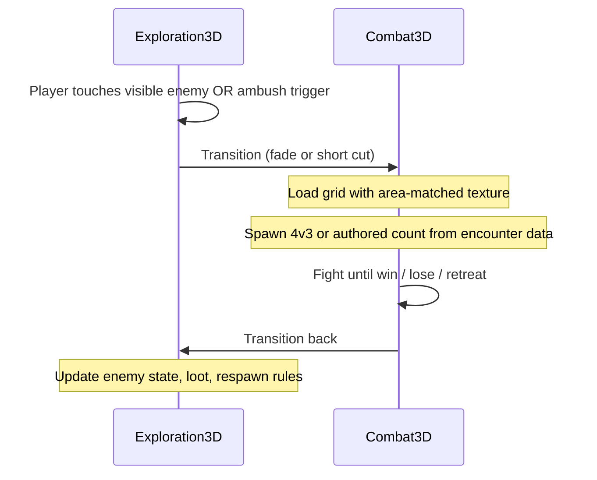

# Prototype Plan

Defines **Phase 1** (combat greybox) and **Phase 2** (exploration + handoff) scope so implementation can start without resolving every full-game TBD. Full-game rules remain in [combat.md](combat.md), [attributes.md](attributes.md), and [exploration.md](exploration.md).

## Phase overview

| Phase | Goal | Dimensionality |
|-------|------|----------------|
| **Phase 1 (v0)** | Prove tactical combat loop | **3D battle view** on a **6×6** playtest grid; no playable exploration module |
| **Phase 2** | Explore → fight → return | **3D exploration** (fixed/tracking cameras) linked to Phase 1 combat |

**Decided:** **Combat-first.** Exploration is documented now but built after the combat greybox is fun.

---

## Phase 1 — Combat greybox (v0)

**Status (Aug 2026):** **Functional at core.** Playable 4v3 test encounter with move/action/wait, CTB turns, combat resolution, spells/skills/items, retreat, win/lose/escape, and greybox UI. Automated smoke tests in `scripts/test/combat_smoke_test.gd`. Phase 2 (exploration handoff) not started.

### Success criteria

- 4 allies vs 3 enemies on shared **6×6** grid (expanded from planned 5×5 for v0 spacing; full-game target remains 5×5 — see [combat.md](combat.md))
- Turn flow: **Move + Action** (either order), or **Wait** (skips both)
- CTB-style turn order: higher **Agility** acts first; sufficiently higher AGI may gain **extra turns** (exact formula **TBD** — principle only for v0)
- Physical hit/damage and at least **one spell** using documented stat rules (placeholders OK)
- Win, lose, and **Retreat** (from Action submenu) functional on test map

### Test roster

**Decided:** Fixed **4 allies vs 3 enemies** for v0 (stress-tests grid congestion vs final 1–4 / 1–4 range).

**Implemented (Phase 1 build):** `data/characters.json` — **Bran**, **Mira**, **Owen**, **Elara**. `data/enemies.json` — **Hollow**, **Wretch**, **Shade**. Encounter `test_4v3` in `data/encounters.json`.

### Battle grid (logic + presentation)

**Decided:**

- **Logic:** Coordinate grid (e.g. `Vector2i` occupancy), not TileMap-driven rules. **v0 uses 6×6** (`CombatConstants.GRID_SIZE`).
- **Presentation:** **3D battleground** — grid tiles rendered in 3D.
- **Area texture:** Battleground uses a **texture matching the overworld area** where the fight would occur (in v0, a single test “area” texture is enough; Phase 2 supplies real context).

**TBD:** Tile height, character model scale (greybox capsules in use).

**Implemented (Phase 1 build):**

- Fixed **Camera3D** behind allies, looking toward enemies (~55° FOV); no player camera control.
- Greybox **colored capsules** (blue allies, red enemies) with 3D name labels and HP bars; active unit **gold highlight + scale**.
- Tile spacing via `CombatConstants.TILE_SIZE` (1.4 units); unit capsules sit 0.8 units above tile surface.
- **Frontline movement:** allies cannot enter an enemy’s row or beyond; enemies cannot enter an ally’s row or beyond (`_get_movement_row_bounds()`).
- **Attack paths:** melee = 8-direction adjacent (Chebyshev 1); ranged = straight/diagonal lines with unit blocking on intervening tiles.
- **KO handling:** KO’d allies remain on the board; defeated **enemies** are removed after `ENEMY_REMOVE_DELAY` (2 s).

### Turn UI

**Decided:** Two-level menu.

**Main turn menu**

| Option | Effect |
|--------|--------|
| **Move** | Move on grid (fixed range per character; equipment may modify) |
| **Action** | Opens action submenu |
| **Wait** | Skip **both** move and action; turn ends |

**Action submenu**

| Option | Effect |
|--------|--------|
| **Attack** | Weapon attack (physical; STR/DEX rules) |
| **Spell** | Cast from global pool |
| **Skill** | Character-specific skill (v0: one stub per test character) |
| **Item** | Use consumable |
| **Retreat** | Attempt flee (AGI + LUK; disabled on boss/test flags) |

**Decided turn economy:**

- **Move and Action** may both be used in one turn, in **either order**.
- **Wait** skips move and action entirely.
- Using **Retreat** or any action submenu option counts as the turn’s **Action** (move may still be taken before or after unless **TBD** — default: move and action both allowed, retreat consumes action).

**TBD:** Whether Retreat also forfeits remaining movement if chosen first.

**Implemented (Phase 1 build):**

- Two-level menu in **CommandPanel** (bottom-left): main (Move / Action / Wait) and action submenu (Attack / Spell / Skill / Item / Retreat).
- **Back** returns up the menu stack; spell/item lists stack **above** the command bar and hide on back.
- **Attack** disabled when no valid target in range.
- **Top-left HUD:** turn order + party HP/MP in stacked panel containers (`TopLeftHud` VBox).
- **Battle log:** top-right panel with fixed max size and scroll.
- Input: mouse — menu buttons, raycast tile clicks, unit/capsule clicks for targeting.
- Resolution: **1920×1080** viewport.

### CTB / Agility

**Decided:**

- Turn order is **not real-time** (no ATB gauges filling during player input).
- Higher **Agility** → acts **earlier** in the order.
- If Agility is **sufficiently higher** than opponents, a unit may take **more turns** over a period (exact threshold **TBD** — document principle in v0, tune in playtest).

**TBD:** Initiative queue algorithm, haste/slow, tie-breakers ([combat.md](combat.md)).

**Implemented (Phase 1 build):** `TurnQueue` sorts living units by Agility (desc). Units with AGI ≥ `CombatConstants.EXTRA_TURN_AGI_FACTOR` × round average receive a duplicate queue slot (placeholder extra-turn rule).

### Spells (v0)

**Decided:**

- **Global spell pool** ([progression.md](progression.md)).
- **v0:** All test spells **pre-unlocked** (no unlock system yet).
- **v0:** **All unlocked spells available in battle** — no equip slot limit (full-game loadout rules **TBD** later).

**TBD:** Which test spells exist in greybox (suggest 3–5 including one fire spell).

**Implemented (Phase 1 build):** `data/spells.json` — **Firebolt** (fire), **Mend** (heal), **Arc Bolt** (physical). All pre-unlocked; selectable from Action → Spell. **No tile range** in v0 (any valid ally/enemy target on the grid). **Delayed cast:** selecting spell + target spends MP and ends the turn; spell resolves at the **start of the caster’s next turn** (`pending_spell` on `CombatUnit`).

### Skills (v0)

**Decided:** **One stub Skill per test character** — proves menu path and per-character identity; full skill design remains **TBD** ([progression.md](progression.md)).

**Implemented (Phase 1 build):** `data/skills.json` — **Power Strike** (Bran), **Guard Break** (Mira), **Aimed Shot** (Owen, ranged), **Focus** (Elara, instant MP restore). Targeting uses skill `range` where applicable.

### Items (v0)

**Decided:** Action → Item includes **heal** and **revive** test items (supports KO/revive loop).

**TBD:** Item IDs, potency, inventory limits.

**Implemented (Phase 1 build):** Party inventory in `data/encounters.json` — **3× Heal Potion** (25 HP), **1× Revive Charm** (revive at 15 HP). Shared inventory; range 2 tiles.

### Damage types (v0)

**Decided:** Implement data model support for all documented types eventually; **greybox combat** uses:

- **Physical**
- **Fire** (first elemental)

Other types (cold, wind, earth, holy, darkness) — defer to post-v0 ([attributes.md](attributes.md)).

### Systems deferred from Phase 1

Use placeholders or omit entirely in v0:

| System | Phase 1 approach |
|--------|------------------|
| Weapon mastery / combos | Single hit only |
| Durability / ammo | Infinite or omitted |
| Spell unlock triggers | All test spells open |
| Character level-up / stat allocation | Fixed test stats |
| Difficulty tiers / save systems | Dev build only |
| Enemy stat UI | Hidden (same as full game) |
| Full status ailment list | Minimal (optional poison stub) |
| Exploration | Not playable — see Phase 2 |

### Numeric formulas

**Decided:** Use **placeholder constants** for HP, MP, hit %, STR vs VIT, Mind vs Res, INT multiplier — tune in playtest. Principles in [attributes.md](attributes.md); numbers **TBD**.

**Implemented (Phase 1 build):** All placeholder numbers live in `scripts/battle/combat_constants.gd`. Resolution logic in `scripts/battle/combat_resolver.gd`.

---

## Phase 2 — Exploration and combat handoff

**Status (Aug 2026):** **Functional at core.** Greybox test room with WASD movement, 3 camera zones, visible overworld enemies, manual checkpoint, door-linked second room, character menu (I), and explore ↔ battle transitions via `GameState` + `SceneTransition`. Ambush encounters deferred.

### Success criteria

- Player moves in **3D** space with **fixed camera positions + tracking** ([exploration.md](exploration.md)).
- **Visible enemies** and at least one **scripted ambush** trigger combat. *(v1: visible enemy only; ambush deferred.)*
- After combat, player returns to exploration at authored positions/state.

### Explore → combat transition

**Decided flow:**

**Decided:**

1. **Trigger:** Contact with visible enemy, or scripted ambush volume / event.
2. **Context pass:** Overworld **area id** (or texture source) passed to combat so battleground matches environment.
3. **Spawn:** Encounter data defines ally/enemy count and **starting grid positions** (v0 used fixed 4v3; Phase 2 uses per-encounter data).
4. **Return on victory:** Remove or flag defeated overworld enemy; apply loot.
5. **Return on retreat:** Enemy remains (or authored exception); party returns to explore state near trigger point.
6. **Return on defeat:** Reload **manual checkpoint** if saved; otherwise reset party and spawn at area default. *(Full difficulty-tier saves remain TBD — [difficulty-saves.md](difficulty-saves.md).)*

**Implemented (Phase 2 build):**

| Topic | Choice |
|-------|--------|
| **Entry scene** | `scenes/main.tscn` → `scenes/explore/village_square.tscn` (Chapter 1 hub); test rooms retained for smoke tests |
| **Movement** | WASD `CharacterBody3D`; protagonist-only capsule in explore |
| **Cameras** | 3 `CameraZone` areas; `CameraRig` tracks player within zone |
| **Battle bridge** | `GameState` party/inventory snapshot + `SceneTransition` fade (~0.4s) |
| **Overworld enemy** | Contact trigger → `test_room_wretch` encounter (4 allies vs 1 Wretch) |
| **Checkpoint** | Press **E** in checkpoint alcove; defeat restores checkpoint state |
| **Character menu** | Press **I** in explore for Items, Equipment, Status, Map, Config |
| **Equipment** | Weapon, armor, helmet, accessory x2 with stat bonuses; owned pool in `data/party_equipment.json` |
| **Settings** | `Settings` autoload persists graphics/audio/input to `user://settings.cfg` |
| **Result UI** | Explore battles show **Continue**; standalone battle keeps **Restart** |
| **Data** | `data/areas.json`, explore-linked row in `data/encounters.json` |
| **Tests** | Explore handoff covered in `scripts/test/combat_smoke_test.gd` |

**TBD:**

- Stealth / detection radius
- Overworld advantage (back attack) affecting starting positions or CTB
- Re-engaging same enemy after retreat
- Fade vs in-engine camera transition duration

### Phase 2 exploration scope (minimal)

- **Chapter 1 — The Hollowed Village:** 5-room hub (`village_square`, `old_chapel`, `weavers_cottage`, `granary`, `root_cellar`) with map tab layout, locked cellar door, closet ambush key loop, mini-boss (`pale_warden`), and save checkpoints in chapel/cellar
- Legacy **test rooms** (`test_room`, `adjacent_room`) kept for automated smoke tests
- Each room uses **2–3 camera zones**; doors connect hub-and-spoke with tuned spawn positions

---

## Implementation guidance

**Decided for prototype code:**

| Topic | Choice |
|-------|--------|
| **Game data** | **JSON** loaded at runtime (characters, spells, weapons, enemies, encounters) |
| **Battle logic** | 6×6 logical grid in v0; 3D scene for tile + unit presentation |
| **Scene split** | Separate combat scene (Phase 1); exploration scene added Phase 2 |
| **Autoloads** | Recommend `GameState`, `BattleManager` (names **TBD** in code) |

**Implemented (Phase 1 build):**

| Topic | Choice |
|-------|--------|
| **Entry scene** | `scenes/main.tscn` → `scenes/explore/village_square.tscn`; battle via `scenes/battle/battle.tscn` |
| **Autoload** | `GameState` (session bridge), `SceneTransition` (fade transitions) |
| **Data layout** | `data/*.json` loaded by `DataLoader` into typed RefCounted classes |
| **Input** | Mouse-first — click menu buttons; raycast tile/unit selection on battleground |
| **Battle end** | Result panel (Victory / Defeat / Escaped) + **Restart Battle** reloads scene |
| **Enemy AI** | Move toward nearest living ally (respects frontline); attack when in weapon range |
| **Tests** | Headless smoke tests (`scripts/test/combat_smoke_test.gd`) |

**TBD:** JSON schema files, whether to add CSV export later for designers.

---

## Relation to full game

| Full-game rule | Prototype note |
|----------------|----------------|
| Party 1–4 vs enemies 1–4 | v0 fixed 4v3 |
| Global spell pool + unlock | v0 all test spells unlocked |
| 8 attributes + gear | v0 fixed stats; minimal or no gear |
| 2D vs 3D | v0 **3D battle**; exploration **Phase 2** |
| All damage types | v0 physical + fire |
| Move + 1 action | v0 **Action submenu** + **Move** + **Wait** |

When Phase 1 milestones pass, revise this doc and promote decisions into [combat.md](combat.md) / [progression.md](progression.md) where they differ from launch intent.

## Open questions (TBD)

- Agility extra-turn threshold formula (placeholder `EXTRA_TURN_AGI_FACTOR = 1.35` in `combat_constants.gd`)
- Retreat vs remaining movement order (v0: retreat consumes action only; move may still be taken before/after)
- Game over on party wipe in v0 vs reload test scene (v0: **Defeat** panel + Restart)

## Resolved in Phase 1 build

- **Combat camera:** Fixed behind allies, looking toward enemies; no orbit
- **Grid size:** 6×6 playtest grid (deviation from full-game 5×5 — revisit after playtest)
- **Test JSON content:** See `data/` — 4 allies (Bran, Mira, Owen, Elara), 3 enemies (Hollow, Wretch, Shade), encounter `test_4v3`
- **File layout:** `data/*.json`, `scripts/data/`, `scripts/battle/`, `scenes/battle/`, `scripts/test/`
- **Battle end flow:** Result screen + scene reload on Restart
- **Spell delay:** MP spent on cast declaration; effect on caster’s next turn
- **Attack paths:** Melee adjacent; ranged line-of-sight with blocking
- **Frontline:** Row-bound movement per side
- **UI panels:** Turn order, party stats, command menu, battle log — container-based layout at 1920×1080
